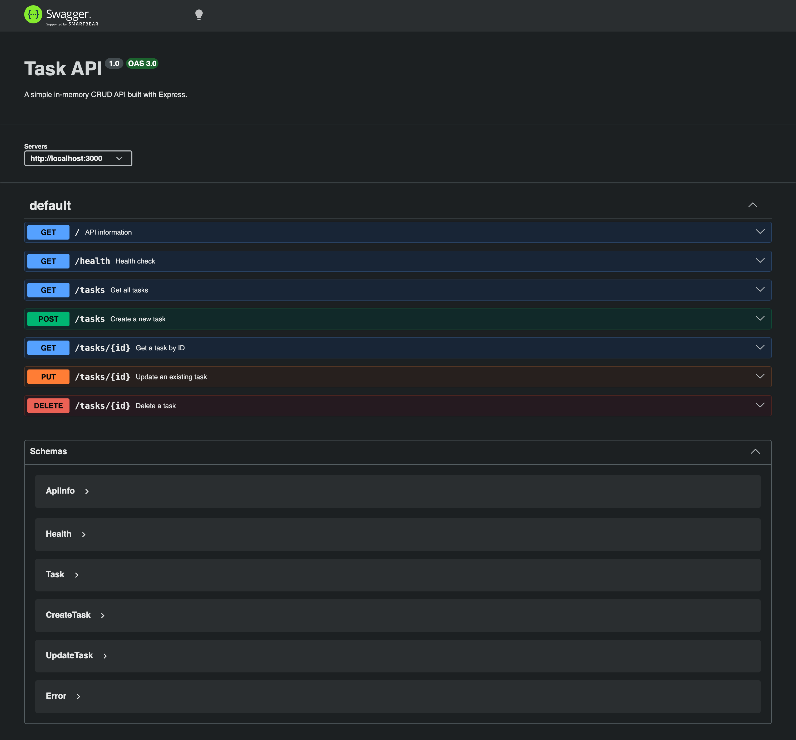

# Task API

A simple in-memory CRUD API built with **Node.js** and **Express**. This project demonstrates the fundamentals of RESTful API development, including creating, reading, updating, and deleting tasks. It also includes interactive API documentation using **Swagger UI**.

---

## Features

- RESTful CRUD API
- In-memory task storage
- Input validation
- Proper HTTP status codes
- Swagger UI documentation

---

## Installation & Running

### Prerequisites

- Node.js (v18+ recommended)
- npm

### Install dependencies

```bash
npm install
```

### Run the server

```bash
node index.js
```

The server will start on:

```
http://localhost:3000
```

Swagger UI is available at:

```
http://localhost:3000/api-docs
```

---

# API Endpoints

| Method | Endpoint | Description | Success Status |
|--------|----------|-------------|----------------|
| GET | `/` | Get API information | 200 |
| GET | `/health` | Health check | 200 |
| GET | `/tasks` | Get all tasks | 200 |
| GET | `/tasks/:id` | Get a task by ID | 200 |
| POST | `/tasks` | Create a new task | 201 |
| PUT | `/tasks/:id` | Update an existing task | 200 |
| DELETE | `/tasks/:id` | Delete a task | 204 |

---

# Example Request

Create a new task:

```bash
curl -i -X POST http://localhost:3000/tasks \
-H "Content-Type: application/json" \
-d "{\"title\":\"Buy milk\"}"
```

Example response:

```http
HTTP/1.1 201 Created
X-Powered-By: Express
Content-Type: application/json; charset=utf-8
Content-Length: 41
ETag: W/"29-xxxxxxxxxxxxxxxx"

{
  "id": 4,
  "title": "Buy milk",
  "done": false
}
```

---

# Swagger Documentation

Interactive API documentation is available at:

```
http://localhost:3000/api-docs
```

## Swagger UI Screenshot



---

# Project Structure

```
.
├── index.js
├── swagger.json
├── package.json
├── package-lock.json
├── README.md
└── images
    └── swagger-ui.png
```

---

# Technologies Used

- Node.js
- Express.js
- Swagger UI Express
- OpenAPI 3.0